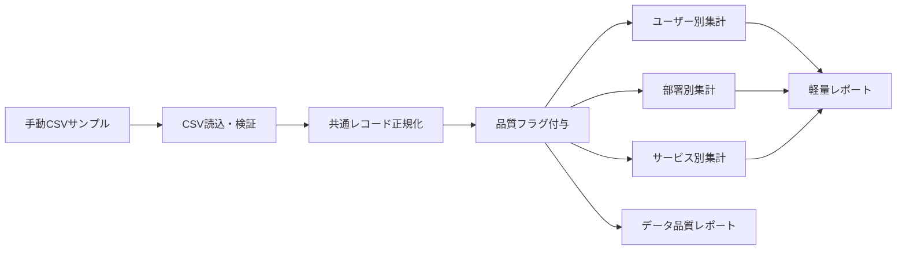

# issue #1 AI利用状況スナップショットMVP 全体Plan

- 作成日: 2026-06-11
- 対象Issue: [#1 手動CSVインポートでAI利用状況スナップショットMVPを作る](https://github.com/suusanex/tool_ai_usage_snapshot/issues/1)
- Plan種別: 親Plan / 実装前の全体像
- 現在の結論: まず「共通スキーマ」「手動CSV取込」「集計レポート」「データ品質表示」「本文系データを保存しない境界」をMVPの中核に置く。各AIサービスからの実データ取得・CSV形状確認は、実装前または実装途中の調査スパイクとして分離する。

## 1. Source of Truth

このPlanは次を契約として扱う。

- GitHub issue #1 の本文
- `AGENTS.md` の共通実装ルール
- repo-local の計画・状態管理方針

issue #1 のSource情報:

- source_workitem: `workitems/ready/ai-usage-snapshot-mvp-schema-and-manual-import-01.yaml`
- management_repo: `suusanex/personal-project-driver`
- project_id: `ai-usage-snapshot`

## 2. ゴール

複数AIサービスの利用状況を、手動CSVから共通スキーマへ取り込み、次の観点で最小限に比較・確認できる成果物を作る。

- ユーザー別の複数サービス併用状況
- 部署別の利用者数、利用率、サービス偏り、ライセンス未利用候補
- サービス別の利用者数、休眠候補、重複利用者数、データ信頼度
- `0` と `unknown` を混同しない集計
- データ出所、取得方法、信頼度、最終更新日、未取得サービスの明示

MVPの目的は「完璧な自動収集」ではなく、手動CSVを安全に受け取り、後続の収集改善やAPI調査を積み上げられる共通の受け皿を作ること。

## 3. 非ゴール

issue #1 のOut of scopeを維持する。

- 全AIサービスの完全自動収集
- 管理画面のRPA/Playwright操作
- 外部サービスへのログイン
- secret/API token の入力や保存
- 外部APIの本番実行
- リアルタイム監視
- 監査ログ基盤やSIEM連携
- 利用量と成果物の因果分析

追加で、このPlan段階では次も非ゴールとする。

- 各サービス固有APIの正式採用
- 本番組織データの取得
- 課金額の正確な按分
- 会話本文、プロンプト本文、生成結果本文の保存や解析

## 4. 作業仮説

確度がまだ低い前提は作業仮説として扱う。

- 作業仮説1: 最初の実装は .NET/C# File-based Apps で十分に成立する。
- 作業仮説2: 手動CSVの列はサービスごとに揺れるため、MVPでは「共通スキーマCSVを読む」ことを先に実装し、サービス固有CSVから共通スキーマへの変換は別スパイクまたは後続sliceに分離するのが安全。
- 作業仮説3: 実データの取得実験では、管理画面ログインやRPAを使わず、手動でエクスポートされたCSVまたは匿名化サンプルだけを入力にする。
- 作業仮説4: 休眠候補や未利用候補は、サービスごとに取得できる項目が異なるため、判定理由と信頼度を併記しないと誤読される。

## 5. 対象スキーマ

issue #1 の共通CSVスキーマをMVPの入力契約とする。

```csv
period_start,period_end,user_key,user_email,display_name,department,service,license_status,active,active_days,event_count,event_unit,last_activity_at,collection_method,source_confidence,imported_at,notes
```

### 5.1 型と意味の初期方針

| 列 | 初期方針 |
| --- | --- |
| `period_start`, `period_end` | 集計対象期間。日付として検証する。 |
| `user_key` | サービス横断の主キー候補。空の場合は `user_email` との扱いを設計で明示する。 |
| `user_email` | ユーザー照合の補助キー。個人情報なので出力粒度に注意する。 |
| `display_name` | 表示用。集計キーにはしない。 |
| `department` | 部署別集計キー。未取得は `unknown`。 |
| `service` | サービス名。正規化ルールを持つ。 |
| `license_status` | `licensed` / `unlicensed` / `unknown` などの管理値を設計する。 |
| `active` | 利用有無。`true` / `false` / `unknown` を区別する。 |
| `active_days` | 期間内アクティブ日数。数値の `0` と `unknown` を区別する。 |
| `event_count` | イベント数。数値の `0` と `unknown` を区別する。 |
| `event_unit` | `requests` / `messages` / `days` / `seats` など。サービス差異を表現する。 |
| `last_activity_at` | 最終活動日時。未取得は `unknown`。 |
| `collection_method` | `manual_csv` など取得方法を明示する。 |
| `source_confidence` | `high` / `medium` / `low` / `unknown` など。 |
| `imported_at` | 取込日時。古いデータ判定に使う。 |
| `notes` | データ制約や手動補正の説明。本体系データは入れない。 |

### 5.2 `0` と `unknown` の境界

MVPの重要要件として、取得不能と利用ゼロを別状態として扱う。

- `0`: 取得元が明示的にゼロを示した値。
- `unknown`: 取得元に値がない、CSV列が欠けている、または変換で判定不能な値。
- 空文字: 入力としては受け取るが、正規化後は `unknown` または検証エラーへ寄せる。

集計ロジックでは `unknown` をゼロ加算しない。利用率や休眠候補の分母・分子に含める場合は、レポートに「unknownを含む/除外する」扱いを明記する。

## 6. 予定成果物

MVP完了時点の想定成果物は次の通り。

| 種別 | 予定パス | 内容 |
| --- | --- | --- |
| README | `README.md` | 使い方、データ境界、RPA/API非使用、本文系データ非保存を明記する。 |
| 設計メモ | `docs/design.md` または `docs/privacy-and-data-boundary.md` | スキーマ、unknown方針、データ品質、非保存データを説明する。 |
| サンプル入力 | `samples/input/*.csv` | 共通スキーマ形式の手動CSVサンプル。 |
| 実行ツール | `src` または単一 `.cs` | .NET/C# File-based Apps を優先する。 |
| 集計出力 | `out/*.csv` または `out/report.md` | ユーザー別、部署別、サービス別、品質レポート。 |
| テスト | `tests` または repo 方針に沿うテスト配置 | unknown/zero、集計、検証エラー、本文データ非保存境界を確認する。 |

具体パスは実装契約フェーズで決める。現時点では成果物の種類と責務だけを固定する。

## 7. 全体アーキテクチャ案



### 7.1 主要コンポーネント候補

| コンポーネント | 責務 |
| --- | --- |
| CSV Reader | 共通スキーマCSVを読み、ヘッダー・型・必須列を検証する。 |
| Normalizer | 空値、`unknown`、サービス名、bool/数値/日時を正規化する。 |
| Quality Classifier | 低信頼、古いデータ、未取得、手動集計のフラグを付ける。 |
| Aggregator | ユーザー別、部署別、サービス別の集計を作る。 |
| Report Writer | CSVまたはMarkdownの出力を作る。 |
| Privacy Boundary Checker | 本文系データを保存しない設計・サンプルを検証する。 |

### 7.2 依存関係の検討

独自実装に入る前に次を確認する。

- BCLのCSV対応は限定的なので、CSVパーサーとして `CsvHelper` などのOSS採用を検討する。
- 日付・数値・boolの変換はBCLを優先する。
- CLI引数処理は、MVPではBCLの簡素な処理で足りる可能性がある。複雑化する場合のみ `System.CommandLine` などを検討する。

採用しないOSSや独自実装を選ぶ場合は、理由を設計メモまたは実装契約に記録する。

## 8. 調査スパイク計画

このプロジェクトは、実サービスから手動取得できるファイルの形状確認が必要になる可能性が高い。MVP本体と混ぜると境界が不明確になるため、次のスパイクに分ける。

### Spike A: 共通スキーマCSVの手動サンプル成立確認

- 目的: issue #1 の共通スキーマだけでMVP集計が成立するか確認する。
- 入力: 人工サンプルCSV。個人情報や本文データを含めない。
- 出力: サンプルCSV、想定集計表、足りない列のメモ。
- 完了条件: 複数サービス・複数部署・unknown/0混在のケースを表現できる。

### Spike B: サービス固有CSVの形状確認

- 目的: 実サービスから手動取得できるCSVやエクスポートの列揺れを把握する。
- 入力: 手動で取得され、必要に応じて匿名化されたCSV。
- 禁止: 自動ログイン、RPA、API token入力、外部API本番実行。
- 出力: `docs/source-csv-notes.md` のような形状メモ。必要なら変換仕様候補。
- 完了条件: 共通スキーマへ直接入力できるか、変換前処理が必要かを判断できる。

### Spike C: データ品質・信頼度ルール確認

- 目的: `source_confidence`、古いデータ、手動集計、未取得サービスの表示ルールを決める。
- 入力: Spike A/B のサンプルと想定運用。
- 出力: 品質判定ルール表。
- 完了条件: レポートが「低信頼データを低信頼として表示する」状態になる。

### Spike D: 未利用・休眠候補の判定確認

- 目的: ライセンス未利用候補と休眠候補の条件を、誤検知を前提に安全に設計する。
- 入力: active、active_days、event_count、last_activity_at、license_status の組み合わせサンプル。
- 出力: 判定理由つき候補一覧の仕様。
- 完了条件: 候補表示に根拠列と信頼度が含まれる。

## 9. 実装slice案

### Slice 1: 設計・サンプル・README境界

- 共通スキーマ仕様を文書化する。
- 本文系データを保存しない境界を明記する。
- RPA/Playwright、ログイン、secret/API token、外部API本番実行を使わない境界を明記する。
- unknown/0 の扱いを文書化する。
- 人工サンプルCSVを作る。

完了条件:

- READMEまたは設計メモに、issue #1 の境界条件が追跡可能な形で残る。
- サンプルCSVに複数サービス、複数部署、unknown/0混在ケースがある。

### Slice 2: CSV読込・検証

- 共通スキーマCSVを読み込む。
- 必須列、型、管理値、日付範囲を検証する。
- エラー時はフォールバックせず、失敗を明示する。
- 例外を捨てる場合はトレースログへ `Exception.ToString()` を出す。

完了条件:

- 正常CSVを読み込める。
- 欠損列、型不正、未知の管理値を検出できる。
- `0` と `unknown` の入力を別状態として保持できる。

### Slice 3: 正規化・品質フラグ

- 空値、`unknown`、bool、数値、日時、サービス名を正規化する。
- `collection_method` と `source_confidence` を品質表示へ反映する。
- 古いデータ、低信頼データ、手動集計、未取得サービスを表現する。

完了条件:

- 集計前レコードに品質フラグが付く。
- unknown値がゼロ扱いされない。
- データ出所と最終更新日をレポートへ渡せる。

### Slice 4: 集計出力

- ユーザー別集計を出す。
- 部署別集計を出す。
- サービス別集計を出す。
- 併用サービス数、休眠候補、ライセンス未利用候補を出す。
- データ品質レポートを出す。

完了条件:

- 複数サービスを同じユーザー軸で並べた出力がある。
- 部署別に利用者数、利用率、サービス偏り、ライセンス未利用候補を確認できる。
- サービス別に利用者数、休眠候補、重複利用者数、データ信頼度を確認できる。

### Slice 5: テスト・検証・残件整理

- UnitTestとCI向けIntegrationTestを、実OSや外部サービスを変更しない形で作る。
- サンプルCSVから期待出力が生成されることを検証する。
- 本文系データを保存しない境界を検証またはレビュー可能にする。
- Result reporting instructions に必要な保存先、検証コマンド、残件をまとめる。

完了条件:

- 検証コマンドと結果を報告できる。
- 未対応サービス、手動集計、低信頼データ、古いデータの残件が明示される。
- 管理repoへ戻す `suggested_management_status`、`remaining_work`、`human_required_items` を提示できる。

## 10. 受け入れ条件マッピング

| Issue acceptance criteria | 対応slice | 証跡候補 |
| --- | --- | --- |
| 共通スキーマのCSVを読み込める | Slice 2 | 正常CSV読込テスト、実行ログ |
| 複数サービスを同じユーザー軸で並べた出力 | Slice 4 | ユーザー別CSV/Markdown |
| 部署別に利用者数、利用率、サービス偏り、ライセンス未利用候補を確認 | Slice 4 | 部署別レポート |
| サービス別に利用者数、休眠候補、重複利用者数、データ信頼度を確認 | Slice 4 | サービス別レポート |
| 取得不能な値は `unknown` として表現され、利用ゼロと混同されない | Slice 1-4 | 設計メモ、テスト、出力例 |
| レポートに手動集計・低信頼データ・古いデータ・未取得サービスが明示 | Slice 3-4 | 品質レポート |
| 本文系データを保存しないことがREADMEまたは設計メモに明記 | Slice 1 | README/設計メモ |

## 11. リスクと対策

| リスク | 影響 | 対策 |
| --- | --- | --- |
| サービスごとのCSV列が揃わない | 共通スキーマへ直接取り込めない | MVPは共通スキーマCSV入力に限定し、サービス固有変換は後続sliceへ分離する。 |
| `unknown` がゼロとして集計される | 利用率や未利用候補が誤る | 値型を三値または明示的なunknown状態で表現し、テストで固定する。 |
| 手動集計の信頼度が過大表示される | レポートが意思決定を誤らせる | `source_confidence` と `collection_method` を必ず出力に含める。 |
| 本文系データがサンプルやnotesに混入する | プライバシー境界違反 | README/設計メモで禁止し、サンプルにも含めない。必要なら検査ルールを作る。 |
| 実サービス調査がログイン/RPA/API実行へ広がる | issueの非ゴール違反 | 調査スパイクの入力をユーザー提供の手動CSVに限定する。 |
| 候補判定が断定的に見える | 運用判断を誤らせる | 「候補」「判定理由」「信頼度」を併記する。 |

## 12. 実装方式の初期判断

AGENTS.md に従い、原則として .NET/C# を採用する。スクリプト的に完結する場合は File-based Apps を優先する。

初期候補:

- `ai_usage_snapshot.cs` のような単一File-based App
- `#:package CsvHelper@...` によるCSVパーサー利用
- 入力CSVパスと出力ディレクトリをCLI引数で受け取る

まだ確定しない点:

- 単一 `.cs` で足りるか、複数ファイル化が必要か
- UnitTestの配置と実行方式
- CSV出力だけで足りるか、MarkdownレポートもMVPに含めるか

これらは implementation-contract-kernel 相当の段階で決める。

## 13. 検証方針

### 自動検証

- サンプルCSVの正常取込
- 必須列欠損時の失敗
- `0` と `unknown` の区別
- 複数サービス併用数
- 部署別利用率
- 休眠候補
- ライセンス未利用候補
- 低信頼・古いデータ・未取得サービスの表示

### 手動検証

- レポートの読みやすさ
- 候補表示が断定的すぎないか
- notesやサンプルに本文系データが混入していないか
- 実サービス由来CSVを受け入れるための不足列や変換課題

## 14. 人間判断が必要な項目

次は実装前または調査スパイク時に、プロジェクト側の判断が必要になる可能性が高い。

- 最初に想定するAIサービス名の一覧
- 部署別利用率の分母を「部署メンバー全体」にするか「CSV登場ユーザー」にするか
- ライセンス未利用候補の閾値
- 休眠候補の期間閾値
- 実サービスから手動取得したCSVをこのrepoに保存してよいか、匿名化のみ許可するか
- MarkdownレポートをMVP必須にするか、CSV出力中心にするか

## 15. 推奨ゲート進行

repoのPlan網羅チェック・残件判定フローに沿う場合、次の順で進める。

1. `plan-kernel.agent.md`: この親Planを入力に、要件境界とsliceを確定する。
2. `change-risk-triage.agent.md`: CSV取込・品質表示・プライバシー境界の実装リスクを分類する。
3. `implementation-contract-kernel.agent.md`: 実装方式、CLI、ファイル配置、依存OSS、型設計を確定する。
4. `implementation-contract-review-kernel.agent.md`: contractがnon-trivialならレビューする。
5. `runtime-contract-kernel.agent.md`: 実行コマンド、入出力、失敗時挙動を確定する。
6. `test-design-kernel.agent.md`: unknown/0、品質、候補判定、本文非保存境界のテストを設計する。
7. `implementation-handoff-review.agent.md`: 実装に渡せる状態か確認する。
8. `implementation-execution.agent.md`: READY scopeだけ実装する。
9. `verification-kernel.agent.md`: acceptance criteriaと証跡を照合する。
10. 残件があれば `coverage-gap-triage.agent.md` と `residual-decision-gate.agent.md` へ進む。

このissueは単純な一括実装より、Slice 1-5を順に処理し、必要なスパイクを挟む進め方が安全。

## 16. 初回実装前のNext Action

次のbounded作業として推奨する。

1. この親Planを `plan-kernel.agent.md` 相当でレビューし、MVP必須範囲と後続スパイク範囲を確定する。
2. Slice 1 の実装契約を作る。
3. 人工サンプルCSVとREADME/設計メモを先に作り、unknown/0と本文非保存境界を固定する。
4. その後にCSV読込実装へ進む。

## 17. 完了報告で必ず返す項目

issue #1 のResult reporting instructionsに合わせ、最終報告では次を明記する。

- 実装した共通スキーマの保存先
- サンプル入力の保存先
- 集計出力の保存先
- データ品質レポートの保存先
- `0` と `unknown` の扱いを明記した場所
- 本文系データを保存しない境界を明記した場所
- RPA/Playwrightを使わない境界を明記した場所
- 実行した検証コマンドと結果
- 未対応サービス
- 手動集計・低信頼データ・古いデータの残件
- `suggested_management_status`
- `remaining_work`
- `human_required_items`
